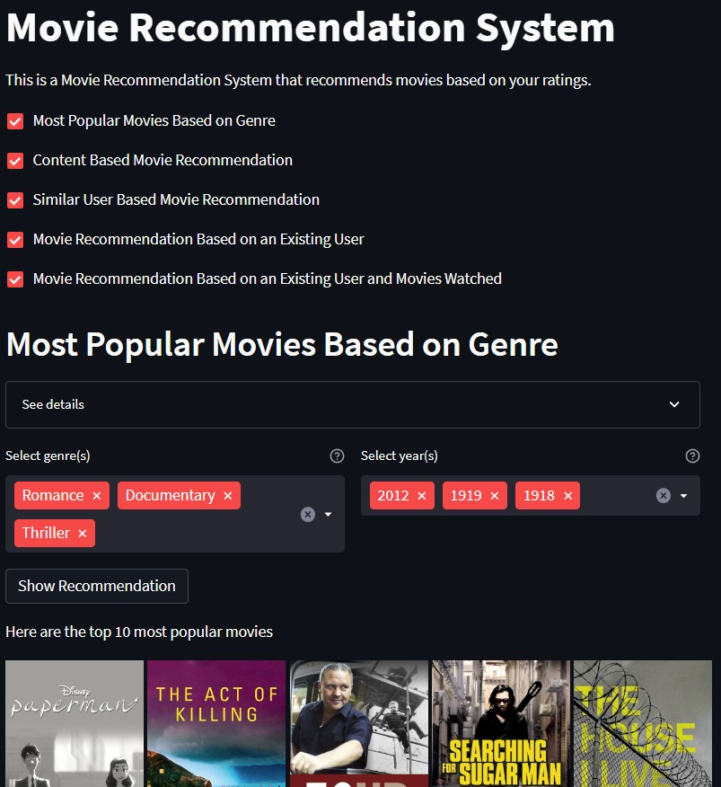

# Movie Recommendation System

This is a movie recommendation system that suggests movies to users based on their preferences. The system utilizes various recommendation methods, including content-based filtering (most popular movies), collaborative filtering, and recommendation specific to existing users, to provide personalized movie recommendations.

## Features

- **Movie search**: Users can search for specific movies and view detailed information about them, including ratings and reviews.
- **Recommendation generation**: The system generates movie recommendations for each user based on various recommendation methods, including content-based filtering (most popular movies), collaborative filtering, and recommendation specific to existing users.

## Setup and Installation

Anaconda installation is necessary for this project as using pip to install 'scikit-surprise' package make create problems. For insatallation of Anaconda package, please refer [here](https://docs.anaconda.com/free/anaconda/install/index.html).

1. Clone the repository:

```shell
git clone https://github.com/abhishek-jana/movie-recommendation-system.git
```

2. Create a new environment using the following command:

```shell
conda create --name myenv
```
3. Activate the newly created environment:

``` shell
conda activate myenv
```
4. Install scikit-surprise from the conda-forge channel:
```shell
conda install -c conda-forge scikit-surprise
```
5. Install the required dependencies:

```shell
cd movie-recommendation-system
pip install -r requirements.txt
```
6. Run the development server:
```shell
streamlit run app.py
```
7. Access the application in your web browser at `http://localhost:8501/`

## Usage
- Start the application and access it in your web browser.
- Use the movie search functionality to find specific movies and view their details, including ratings and reviews.
- Check the recommendation page to see personalized movie suggestions generated using various recommendation methods: content-based filtering (most popular movies), collaborative filtering, and recommendation specific to existing users.


## Results

Here is a screenshot of the movie recommendation system app:




## Data Gathering
The movie data for this project is gathered from the following sources:

- [MovieLens](https://grouplens.org/datasets/movielens/): MovieLens provides a collection of movie ratings data from various sources, which is used to train the recommendation models.

- [TMDB](https://www.themoviedb.org/): TMDB is a comprehensive movie database that provides detailed information about movies, including ratings, reviews, and metadata. It is used to supplement the movie data and provide additional information for better recommendations.

Deployment
The application is deployed using [Streamlit](https://streamlit.io/), an open-source framework for building interactive web applications. The deployment setup instructions can be found in the [Streamlit documentation](https://docs.streamlit.io/streamlit-community-cloud/get-started/deploy-an-app).

## Workflows
The following workflows are implemented in the movie recommendation system:

1. **Movie Search**: Provides users with the ability to search for specific movies and view detailed information, including ratings and reviews.
2. **Recommendation Generation**: Utilizes various recommendation methods, including content-based filtering, collaborative filtering, and user-specific recommendations, to generate personalized movie suggestions.

## Project Specific Workflow:
1. Update `config.yaml`.
2. Update `secrets.yaml` (optional) for database credentials.
3. Update `params.yaml`.
4. Update the entity.
5. Update the configuration manager in src config.
6. Update the components.
7. Update the pipeline.
8. Update the main.py.

Please note that these steps are specific to the project and should be followed accordingly for the movie recommendation system.

## Future Work
Some potential areas for future improvement and expansion of the movie recommendation system include:

- Implementing advanced recommendation algorithms, such as matrix factorization and deep learning-based models.
- Enhancing the user interface and user experience of the application.
- Incorporating additional data sources and features, such as user demographics and movie genres, to improve the accuracy of recommendations.
- Creating an account or logging in to an existing account to personalize recommendations based on individual user preferences.
- Allowing users to rate movies they have watched to further improve the accuracy of recommendations.
- Providing personalized movie recommendations specific to existing users based on their viewing history and preferences.
- Implementing a feedback mechanism for users to provide feedback on recommended movies, helping to refine and enhance the recommendation process.

## Contributing
Contributions are welcome! If you have any ideas, bug reports, or feature requests, please open an issue on the [GitHub repository](https://github.com/abhishek-jana/movie-recommendation-system). Pull requests are also appreciated.

## License
This project is licensed under the MIT License.

## Acknowledgements

I would like to acknowledge the following resources and libraries that were instrumental in the development of this movie recommendation system:

- [MovieLens](https://grouplens.org/datasets/movielens/) for providing the movie ratings dataset used for training the recommendation models.
- [TMDB](https://www.themoviedb.org/) for providing comprehensive movie data and metadata to enhance the recommendations.
- [Streamlit](https://www.streamlit.io/) for the open-source framework used for building the interactive web application.
- [Python](https://www.python.org/) and its various libraries, including [Pandas](https://pandas.pydata.org/), and [Scikit-learn](https://scikit-learn.org/), for their contributions to data processing, machine learning, and recommendation algorithms.

We extend our gratitude to the developers and maintainers of these resources for their valuable contributions to the field of movie recommendation systems.

## References

Here are some helpful references and resources related to movie recommendation systems:

- [Recommendations with IBM](https://github.com/abhishek-jana/Recommendations-with-IBM): A GitHub repository containing a project on building recommendation systems using IBM Watson Studio.
- [Getting Started with a Movie Recommendation System](https://www.kaggle.com/code/ibtesama/getting-started-with-a-movie-recommendation-system): A Kaggle notebook providing an introduction and code examples for building a movie recommendation system.
- [Movie Recommendation System](https://www.kaggle.com/code/darpan25bajaj/movie-recommendation-system/notebook): A Kaggle notebook showcasing the implementation of a movie recommendation system.

These references can provide additional insights, ideas, and code examples for building and enhancing movie recommendation systems.
